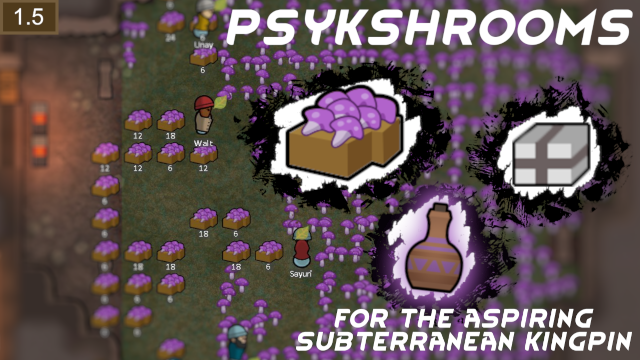

# Psykshroom

### A subterranean solution for the aspiring psychite kingpin

This mod adds Psykshroom, a new type of fungus that can be refined into psychite its related drugs! It can even be eaten raw for a weak mood buff!

What is this?
Psykshroom is essentially a psychedelic underground mushroom form of psychoid plants -- for those of us who like underground colonies, like making fat stacks off flake and yayo, but don't or can't use hydroponics for whatever reason. The harvested product of the psykshroom are the fungal caps -- psykcaps -- which can be used to create flake, yayo, and psychite tea.

Psykcaps are also edible in their raw form, and they will give a mild high to those who eat them. The psykcap high offers maluses to consciousness, moving and sight, and bonuses to mood and psychic sensitivity. It is possible, albeit difficult, to gain a psychite addiction from eating the raw caps, so don't rely on them too much! Refining them into psychite tea, flake, or yayo will always be more profitable and effective when it comes to sale and mood management.

Compared against Psychoid:
- Each psykshroom yields only 5 usable product, compared to psychoid's yield of 8.
- Psykshrooms take 11 growth days to reach maturity, compared to psychoid's 9 days.
- Psykshrooms can be grown underground without light.
- Psykcaps are immediately consumable, unlike psychoid leaves.

### How do I get started?
Exactly like you do with psychoid! Psykshrooms can be planted from the get-go, but still requiring a colonist with level 6 in the plants skill. The creation of psychite tea, flake and yayo still require their respective technologies to be researched.

### Credits
**Lambda** for creating the XML

**DetVisor** for creating the textures

Steam Upload: https://steamcommunity.com/sharedfiles/filedetails/?id=3280268952
